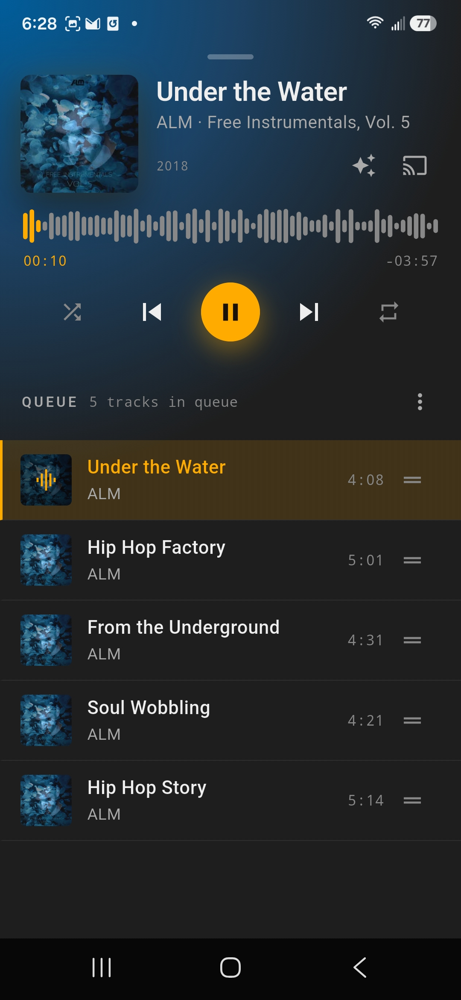
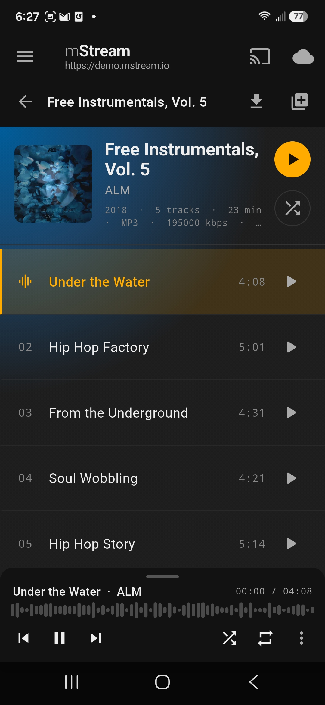
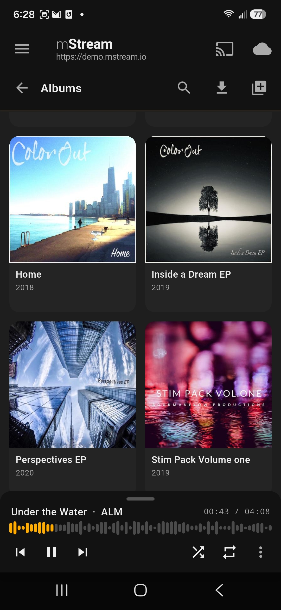
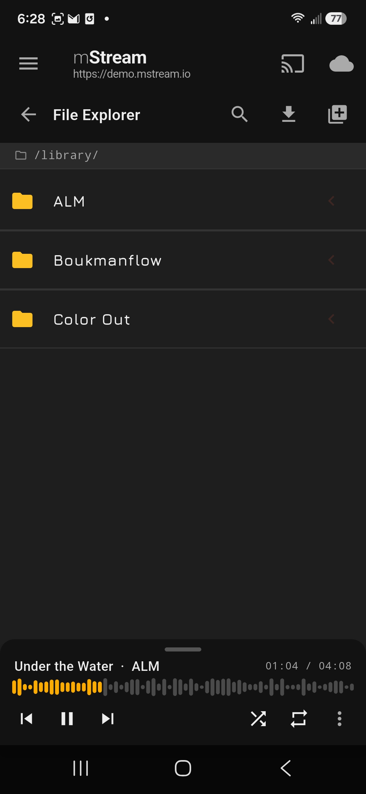
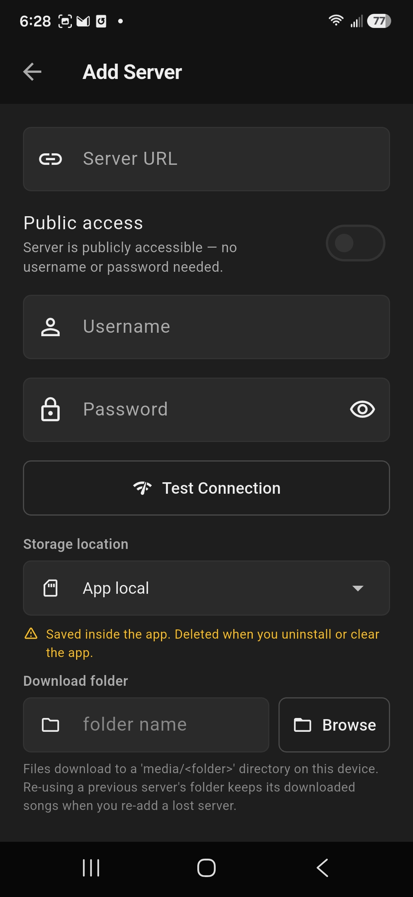
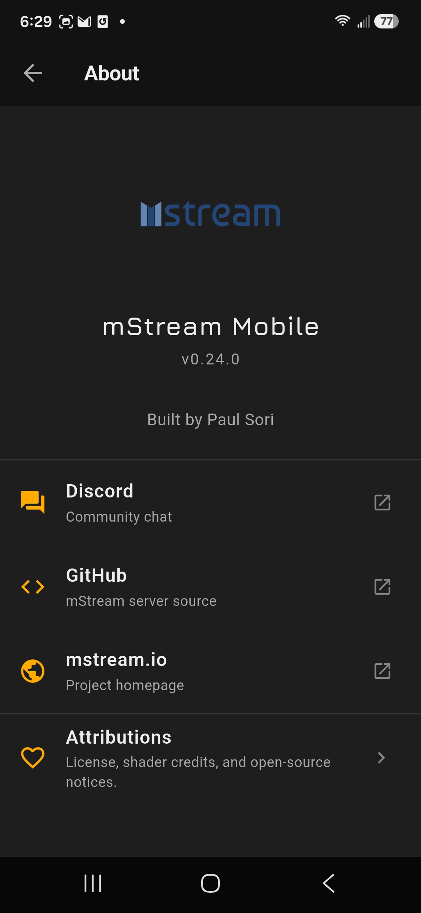

# mStream Music

This is the official mStream Android App

## Screenshots

| Now Playing | Album & Player | Albums |
| :---: | :---: | :---: |
|  |  |  |

| File Explorer | Add Server | About |
| :---: | :---: | :---: |
|  |  |  |

## Features

* Chromecast
* Android Auto
* Transcoding
* Modern UI built with Flutter
* Two visualizer engines
  * Project M
  * Shader Toy

## Releases

**Google Play**

We have an official release on Google Play

https://play.google.com/store/apps/details?id=mstream.music

**APK File**

We also have an apk file. This will show up as 'mStream Plus' and can be installed alongside the google play build.

This build has two additional features:

* Allows self-signed SSL certificates
* Allows files to be downloaded to anywhere on the device

Downloads are available here: https://github.com/IrosTheBeggar/mstream_music/releases

## Languages

mStream has been machine translated to the following languages:

* English
* Chinese
* French
* German
* Italian
* Japanese
* Polish
* Portuguese
* Russian
* Spanish

## Links

* [mStream Server (GitHub)](https://github.com/IrosTheBeggar/mStream)
* [Discord](https://discord.gg/AM896Rr)
* [Demo Site](https://demo.mstream.io)
